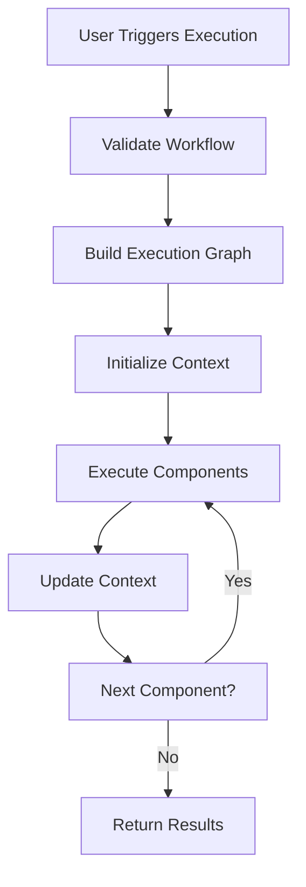

# Architecture Overview

Flowgenix is built as a modern, microservices-based application with a clear separation between frontend, backend, and data layers.

## High-Level Architecture

```
┌─────────────────┐    ┌─────────────────┐    ┌─────────────────┐
│   Frontend      │    │    Backend      │    │   Databases     │
│   (Next.js)     │◄──►│   (FastAPI)     │◄──►│  PostgreSQL     │
│                 │    │                 │    │  ChromaDB       │
└─────────────────┘    └─────────────────┘    └─────────────────┘
         │                       │                       │
         │              ┌─────────────────┐              │
         └──────────────►│   AI Services   │◄─────────────┘
                        │  (Gemini API)   │
                        └─────────────────┘
```

## Frontend Architecture

### Technology Stack
- **Next.js 14**: React framework with App Router
- **TypeScript**: Type safety and better development experience
- **React Flow**: Visual workflow builder with drag-and-drop
- **Tailwind CSS**: Utility-first CSS framework
- **shadcn/ui**: Modern component library
- **Framer Motion**: Smooth animations and transitions

### Key Components

#### 1. Workflow Canvas (`WorkflowCanvas.tsx`)
- Visual drag-and-drop interface
- Node-based workflow representation
- Real-time connection validation
- Auto-layout and positioning

#### 2. Component Library (`ComponentLibraryPanel.tsx`)
- Draggable workflow components
- Component categorization
- Search and filtering

#### 3. Chat Interface (`ChatInterface.tsx`)
- Real-time messaging with AI
- Markdown rendering for AI responses
- File upload support
- Conversation history

#### 4. Authentication System
- JWT token management
- Protected routes
- Automatic token refresh
- User session handling

### State Management
- **React Context**: Global state (auth, workflow)
- **Local State**: Component-specific state
- **Server State**: API data with SWR patterns

## Backend Architecture

### Technology Stack
- **FastAPI**: High-performance async Python web framework
- **SQLAlchemy**: ORM for database operations
- **Pydantic**: Data validation and serialization
- **WebSockets**: Real-time communication
- **Alembic**: Database migration management

### Core Services

#### 1. Authentication Service (`auth.py`)
```python
- JWT token generation and validation
- Password hashing with bcrypt
- User registration and login
- Token refresh mechanism
```

#### 2. Workflow Service (`workflow.py`)
```python
- Workflow CRUD operations
- Execution engine
- Component validation
- State management
```

#### 3. Document Service (`document.py`)
```python
- File upload handling
- Text extraction (PDF, DOCX, TXT)
- Embedding generation
- Vector storage in ChromaDB
```

#### 4. Chat Service (`chat.py`)
```python
- Real-time messaging
- Context retrieval from documents
- LLM integration
- Conversation persistence
```

### API Layer Structure

```
/api/v1/
├── auth/           # Authentication endpoints
├── workflows/      # Workflow management
├── documents/      # Document operations
├── chat/          # Chat functionality
├── users/         # User management
└── health/        # Health checks
```

## Database Design

### PostgreSQL Schema

#### Users Table
```sql
users (
    id: UUID PRIMARY KEY,
    email: VARCHAR UNIQUE,
    password_hash: VARCHAR,
    created_at: TIMESTAMP,
    updated_at: TIMESTAMP
)
```

#### Workflows Table
```sql
workflows (
    id: UUID PRIMARY KEY,
    user_id: UUID REFERENCES users(id),
    name: VARCHAR,
    description: TEXT,
    workflow_data: JSONB,
    created_at: TIMESTAMP,
    updated_at: TIMESTAMP
)
```

#### Documents Table
```sql
documents (
    id: UUID PRIMARY KEY,
    user_id: UUID REFERENCES users(id),
    workflow_id: UUID REFERENCES workflows(id),
    filename: VARCHAR,
    file_path: VARCHAR,
    file_size: INTEGER,
    content_type: VARCHAR,
    created_at: TIMESTAMP
)
```

#### Chat Messages Table
```sql
chat_messages (
    id: UUID PRIMARY KEY,
    workflow_id: UUID REFERENCES workflows(id),
    role: VARCHAR, -- 'user' or 'assistant'
    content: TEXT,
    created_at: TIMESTAMP
)
```

### ChromaDB Collections

#### Document Embeddings
```python
Collection: "document_embeddings"
- Documents: Text chunks from uploaded files
- Embeddings: Vector representations (Gemini embeddings)
- Metadata: {
    "document_id": str,
    "workflow_id": str,
    "chunk_index": int,
    "source": str
}
```

## AI Integration

### Gemini API Integration

#### 1. Text Generation
```python
# LLM responses for chat
model = "gemini-pro"
response = await gemini_client.generate_content(
    prompt=user_query,
    context=document_context
)
```

#### 2. Embeddings
```python
# Document vectorization
model = "embedding-001"
embeddings = await gemini_client.embed_content(
    text=document_chunks
)
```

### Context Retrieval Flow

1. **User Query**: Received via chat interface
2. **Query Embedding**: Generate embedding for user query
3. **Similarity Search**: Find relevant document chunks in ChromaDB
4. **Context Assembly**: Combine relevant chunks as context
5. **LLM Generation**: Send query + context to Gemini
6. **Response**: Return AI response to user

## Workflow Execution Engine

### Execution Flow



### Component Types

#### 1. User Query Component
- **Purpose**: Entry point for user input
- **Outputs**: User message string
- **Configuration**: None required

#### 2. Knowledge Base Component
- **Purpose**: Document storage and retrieval
- **Inputs**: Query for document search
- **Outputs**: Relevant document context
- **Configuration**: Document upload

#### 3. LLM Engine Component
- **Purpose**: AI text generation
- **Inputs**: User query, document context
- **Outputs**: AI-generated response
- **Configuration**: Model selection, parameters

#### 4. Web Search Component
- **Purpose**: External information retrieval
- **Inputs**: Search query
- **Outputs**: Search results
- **Configuration**: Search provider (Brave/SerpAPI)

#### 5. Output Component
- **Purpose**: Final result display
- **Inputs**: Processed results
- **Outputs**: Formatted output
- **Configuration**: Output format

## Security Architecture

### Authentication & Authorization
- **JWT Tokens**: Stateless authentication
- **Token Expiry**: 24-hour access tokens
- **Refresh Tokens**: 7-day refresh cycle
- **Route Protection**: Frontend and backend validation

### Data Security
- **Password Hashing**: bcrypt with salt
- **Environment Variables**: Sensitive data isolation
- **Input Validation**: Pydantic models
- **File Upload Limits**: Size and type restrictions

### API Security
- **CORS**: Configured for frontend domain
- **Rate Limiting**: Prevent abuse (planned)
- **Input Sanitization**: SQL injection prevention
- **Error Handling**: No sensitive data exposure

## Monitoring & Observability

### Metrics (Prometheus)
- HTTP request metrics
- Workflow execution metrics
- Database query performance
- AI API usage tracking

### Logging
- Structured JSON logging
- Request/response logging
- Error tracking
- Performance monitoring

### Health Checks
- Database connectivity
- External API availability
- Service dependencies
- Resource utilization

## Deployment Architecture

### Docker Containers
```yaml
services:
  frontend:     # Next.js app
  backend:      # FastAPI app
  db:          # PostgreSQL
  chromadb:    # Vector database
  prometheus:  # Metrics collection
  grafana:     # Monitoring dashboard
```

### Kubernetes Deployment
- **Namespaces**: Environment separation
- **Services**: Load balancing and discovery
- **Ingress**: External traffic routing
- **ConfigMaps**: Configuration management
- **Secrets**: Sensitive data storage

## Performance Considerations

### Frontend Optimizations
- Code splitting with Next.js
- Image optimization
- Component lazy loading
- Bundle size optimization

### Backend Optimizations
- Async/await patterns
- Database connection pooling
- Vector search indexing
- Response caching (planned)

### Database Optimizations
- Proper indexing strategy
- Query optimization
- Connection pooling
- Vector similarity tuning

## Scalability

### Horizontal Scaling
- Stateless backend design
- External session storage
- Load balancer ready
- Database read replicas (planned)

### Vertical Scaling
- Resource monitoring
- Auto-scaling policies
- Performance profiling
- Bottleneck identification
